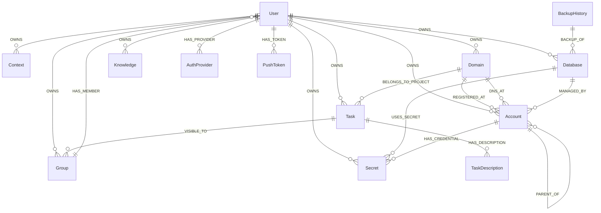

<div align="center">

# ✅ MyTick

**AI-native task & project management for developers.**

Manage tasks, track projects, organize credentials — across web, mobile, and API.

[](https://react.dev)
[](https://github.com/ProgramIsFun/mytick/pulls)

[Features](#-features) · [Getting Started](#-getting-started) · [Architecture](#-architecture) · [API Reference](#-api-reference)

</div>

---

## ✨ Features

### Task Management
- 📝 **Full CRUD** with title, description, deadlines, recurrence
- 🔄 **5 statuses** — Pending, In Progress, On Hold, Done, Abandoned
- 🔗 **Dependencies** — subtasks via `blockedBy` with cycle detection
- 📅 **Calendar view** — click any date to create a task
- 📖 **Description history** — version tracking with rollback
- 🔁 **Recurring tasks** — daily, weekly, monthly, yearly with exceptions
- 🌐 **Sharing** — private, group, or public with share links

### Project Management
- 📁 **Projects** with description, repo URL, local path
- 👥 **Members** with editor/viewer roles
- 🔑 **Credential mapping** — link vault secrets to env vars per project
- 🏦 **Account registry** — track service providers (cloud, banking, email, etc.)

### AI-Native
- 📡 **Context store** — key-value pairs for AI session memory
- 🔐 **Vault integration** — Bitwarden-compatible credential references (provider-agnostic)

### Multi-Platform
- 🌐 **Web** — React + Vite + Tailwind CSS
- 📱 **Mobile** — Expo React Native
- 🔔 **Push notifications** — Firebase Cloud Messaging
- 🌙 **Dark mode** — everywhere

## 🚀 Getting Started

### Prerequisites
- Node.js 20+
- Neo4j 5+ (local or AuraDB)

### Development Environment

| Tool | Version |
|------|---------|
| OS | Windows 11 Pro (Build 26200) |
| nvm | 1.2.2 |
| Node.js | v22.20.0 |
| npm | 10.9.3 |

### Backend

```bash
cd backend
cp .env.example .env   # edit with your values
npm install
npm run migrate
npm run dev            # API on port 4000
```

### Frontend

```bash
cd frontend
npm install
npm run dev            # Web on port 5173
```

### Mobile

```bash
cd mobile
cp .env.example .env
npm install
npx expo start
```

## 🏗️ Architecture

### Project Structure

```
mytick/
├── frontend/          # React web app (Vite + TypeScript)
├── backend/           # Node.js API server (Express + Neo4j)
├── mobile/            # React Native mobile app (Expo)
├── workers/           # Background workers & automation
│   └── nexus-backup/  # Database backup service (AWS Lambda)
├── shared/            # Shared types and utilities
└── 
```

### Graph Schema



Run `npm run schema` to generate an up-to-date diagram from your running database.

### Data Flow

```
┌─────────────┐  ┌─────────────┐
│   React     │  │   Expo      │
│   Web App   │  │  Mobile App │
└──────┬──────┘  └──────┬──────┘
       │                │
       └────────────────┘
                │ HTTP
                        ▼
              ┌──────────────────┐
              │  Express API     │
              │  /api/tasks      │
              │  /api/projects   │
              │  /api/accounts   │
              │  /api/context    │
              │  /api/groups     │
              └────────┬─────────┘
                       │
                       ▼
               ┌──────────────────┐
               │   Neo4j Graph    │
               └──────────────────┘
```

## 📡 API Reference

### Tasks `/api/tasks`
| Method | Endpoint | Description |
|--------|----------|-------------|
| `GET` | `/` | List tasks (paginated, filterable by status) |
| `GET` | `/roots` | Root tasks (not subtasks) |
| `GET` | `/count` | Counts by status |
| `GET` | `/calendar?from=&to=` | Calendar expansion |
| `GET` | `/:id` | Get task |
| `GET` | `/:id/blocking` | Tasks blocked by this task |
| `POST` | `/` | Create task |
| `PATCH` | `/:id` | Update task |
| `DELETE` | `/:id` | Delete task (cleans up blockedBy refs) |

### Projects `/api/projects`
| Method | Endpoint | Description |
|--------|----------|-------------|
| `GET` | `/` | List projects (owned + member of) |
| `GET` | `/:id` | Get project (populated accounts) |
| `POST` | `/` | Create project |
| `PATCH` | `/:id` | Update project |
| `DELETE` | `/:id` | Delete project |
| `GET` | `/by-account/:id` | Projects using an account |
| `POST` | `/:id/members` | Add member |
| `DELETE` | `/:id/members/:userId` | Remove member |

### Accounts `/api/accounts`
| Method | Endpoint | Description |
|--------|----------|-------------|
| `GET` | `/` | List accounts |
| `POST` | `/` | Create account |
| `PATCH` | `/:id` | Update account |
| `DELETE` | `/:id` | Delete account |

### Context `/api/context`
| Method | Endpoint | Description |
|--------|----------|-------------|
| `GET` | `/` | List all entries |
| `GET` | `/:key` | Get by key |
| `PUT` | `/:key` | Set (upsert) |
| `DELETE` | `/:key` | Delete |

## 🔐 Credential Architecture

MyTick tracks credentials without storing secrets:

```
MyTick (metadata)          Password Manager (secrets)
┌──────────────────┐       ┌──────────────────┐
│ Account: Firebase│       │ item: AIzaSy...  │
│  credentials:    │──────▶│ id: aaa-bbb      │
│   - key: API_KEY │       └──────────────────┘
│     vaultId: aaa │
└──────────────────┘
```

- Secrets stored in any password manager (Bitwarden, 1Password, etc.)
- MyTick references by vault item UUID
- Provider-agnostic — swap password managers without changing MyTick
- Supports software services, banking, email, anything

## 🗺️ Roadmap

- [ ] 3D task dependency graph (react-force-graph)
- [ ] Local vault bridge for viewing secrets in browser
- [ ] Auto-provision services (Firebase, Atlas, Render) via APIs
- [ ] Auto-generate `.env` files from project mappings
- [ ] Google/GitHub OAuth login
- [ ] Deploy mobile to app stores
- [ ] Task scheduling with AiRelay integration

## 📄 License

MIT

---

<div align="center">
  <sub>Built with AI, for developers who let AI do the heavy lifting.</sub>
</div>
